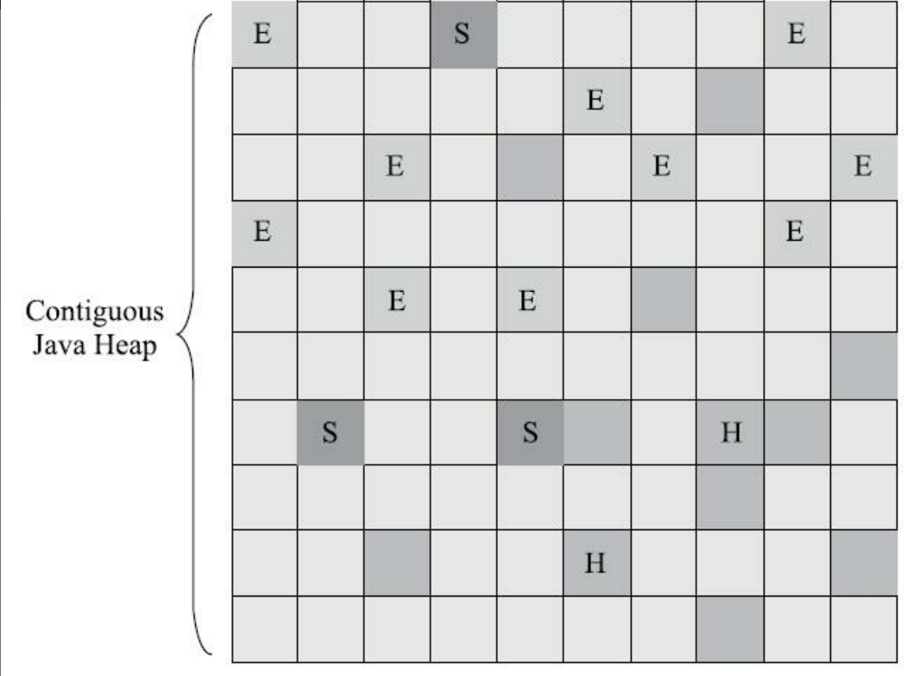

# G1收集器

工作原理：将对内存划分为多个大小相等的独立区域--region，每个region按照需要，扮演者新生代的Eden空间、Survivor空间或者老年代空间。收集器可以针对这些不同的角色采用不同的策略去处理。

设计思想：由于以前的垃圾收集思想存在问题，比如垃圾收集的目标范围要么是整个新生代（Minor GC），要么是整个老年代（Major GC），要么是整个java堆（Full GC）。而G1则是按照哪块内存存放的垃圾数量最多，回收收益最大，来判断是否执行垃圾回收。并且还能设定垃圾收集的消耗时间范围（可预测的停顿时间模型，该模型能够实现的原因是，G1将Region设计为垃圾回收的最小单元，每次收集到的内存空间为Region大小的整数倍，如此可以避免对整个Java对中进行全区域的垃圾回收）。

