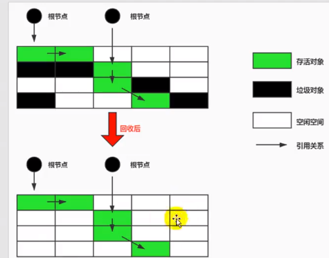
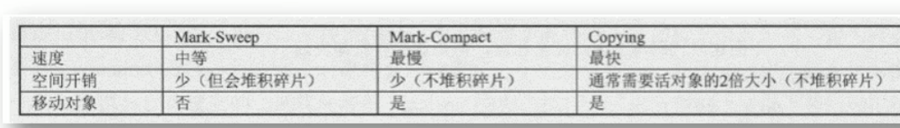

# 垃圾回收算法

**标记阶段：**

* 引用计数算法
* 可达性分析算法

**清除阶段**

* 标记清除
* 复制算法
* 标记压缩算法


分代收集算法/增量收集算法/分区算法


1. 引用计算法

   在对象中添加一个计数器，当有个地方引用它时，计数器就加1；当引用失败时，计数器就减1。

优点：实现简单，垃圾对象便于辨识；判定效率高，回收没有延迟性

缺点：

* 需要单独的字段存储计数器，增加额外的存储空间

* 每次赋值都需要更新计数器，伴随着加减操作，增加时间开销

* 存在循环引用问题

  

应用语言：python

如何解决循环引用？

* 手动解除，在合适的时间，解除引用关系
* 使用弱引用weakref，为python提供的标准库，目的是解决循环引用。


1. 可达性分析算法/根搜索算法

   通过一系列的GC Roots的根对象作为起始节点集，从这些节点开始，根据引用关系向下搜索，搜索过程所走过的路径被称为引用链，如果某个对象到GC Roots间没有任何引用链相连，则证明对象不再被使用
   
   

GC Roots对象包括

* 虚拟机栈（栈帧中的局部变量表）中引用的对象，比如各线程被调用的方法堆中使用到的参数，局部变量，临时变量等。
* 方法区中类静态属性引用的对象
* 方法区中常量引用的对象，比如字符串常量池（String Table）里的引用
* 本地方法栈的JNI（本地方法）引用对象
* Java虚拟机内部的引用，如基本数据类型对应的Class对象，常驻的异常对象（NullPointException，OutOfMemoryError）等，还有系统加载类
* 被同步锁（synchronized）持有的对象
* 本地代码缓存


Finalize逃脱gc代码演示：

```java
public class FinalizeEscapeGC {

    /**
     * 功能演示：
     *  1. 对象可以在被gc时自我拯救
     *  2. 这种自救机会只有1次，因为一个对象的finalize()方法最多只会被系统自动调用一次
     * */

    public static FinalizeEscapeGC SAVE_HOOK = null;

    public void isAlive(){
        System.out.println("yes, i am alived");
    }

    @Override
    protected void finalize() throws Throwable {
        super.finalize();
        System.out.println("finalize method executed!");
        FinalizeEscapeGC.SAVE_HOOK = this;
    }

    public static void main(String[] args) throws Throwable{
        SAVE_HOOK = new FinalizeEscapeGC();

        //对象第一次成功拯救自己
        SAVE_HOOK = null;
        System.gc();

        //因为Finalizer优先级低，暂停0.5秒，来等待被执行
        Thread.sleep(500);
        if (SAVE_HOOK != null){
            SAVE_HOOK.isAlive();
        }else {
            System.out.println("no, i am dead");
        }

        SAVE_HOOK = null;
        System.gc();
        Thread.sleep(500);
        if (SAVE_HOOK != null){
            SAVE_HOOK.isAlive();
        }else {
            System.out.println("no, i am dead");
        }
    }
}
#日志输出
finalize method executed!
yes, i am alived
no, i am dead
```

结论：

在可达性分析算法中被判定为不可达对象，也不会立即被回收。需要经过两个阶段，当没有与GC Root相连接的引用链，它会被标记一次，随后进行一次筛选，条件是此对象是否有必要执行finalize()方法。如果对象在finalize方法中重新与引用链上的任何一个方法建立关联（比如把自己（this）赋值给一个对象的成员变量或类变量），则在第二次标记时它将移出“即将回收”的集合。

代码中对象的finalize方法被成功触发，并在收集前成功逃脱，但是在第二次就失败，原因是，对象的finalize方法只会被系统自动调用一次，如果对象再一次面对回收时，finalize方法就不再被触发，最终导致失败。


引用问题：强引用，软引用，弱引用，虚引用


## 标记-清除算法

工作原理：当堆内存即将耗尽时，会停止整个程序，接着进行两个步骤，第一标记，第二是清除

* 标记：收集器从引用根节点开始遍历，标记所有被引用的对象，记录为可达对象
* 清除：收集器对堆内存从头到尾进行线性的遍历，如果发现某个对象的头部中没有标记为可达对象，则回收对象。（把需要清除的对象地址保存在一个空闲列表中，下次有新的对象加载时，将原有的数据覆盖掉）





优点：简单，容易理解


缺点：效率不高；

​           进行gc时，需要停止整个应用程序--Stop The World

​           存在内存碎片，需要维护空闲列表


## 复制算法

工作原理：将内存分为两块，每次只使用一块内存，在垃圾回收的时候，将使用的内存中存活的对象复制到未被使用的内存中，之后清除正在使用的内存块中未被引用的所有对象。


优点：

* 没有标记和清除过程，实现简单，运行高效
* 复制之后保证内存的连续性，不会出现碎片问题


缺点：

* 需要两倍的内存空间
* 对于G1收集器分拆为大量的region，意味着需要维护region之间对象的引用关系，额外增加内存占用或时间开销。

适用场景：新生代（对象朝生夕死）-- s0/s1，垃圾对象很多，需要复制的存活对象较少。 


## 标记压缩算法

工作原理：第一阶段，和标记-清除算法一样，标记所有从根节点被引用的对象；第二阶段，将所有存活的对象压缩到内存一端，按顺序排放，接着清理边界外所有的空间


优点：

* 不存在内存碎片
* 消除了复制算法中，内存减半的高额开销


缺点：

* 效率低于复制算法

* 在移动对象的时候，需要调整引用地址

* STW时间较长

  

适用场景：老年代内存空间


三种算法的对比：




分代收集算法

