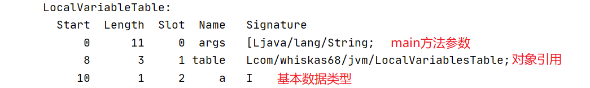
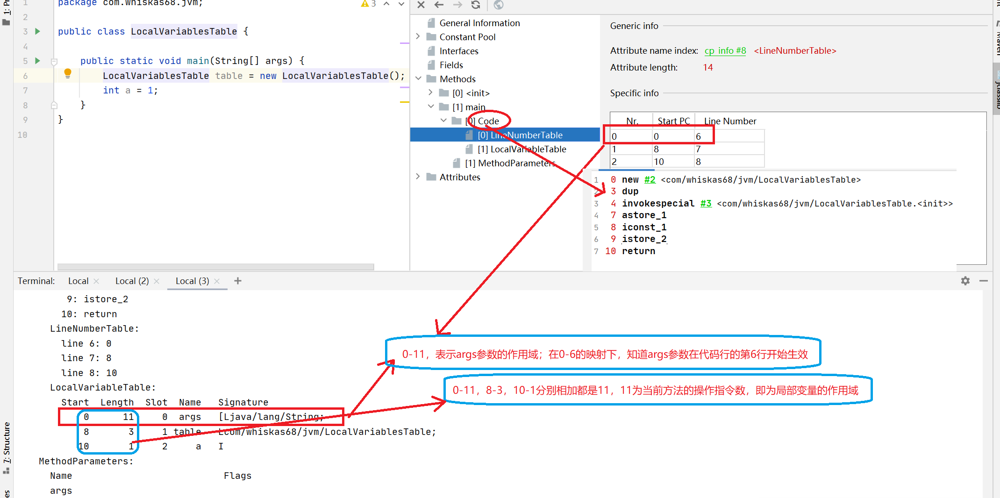
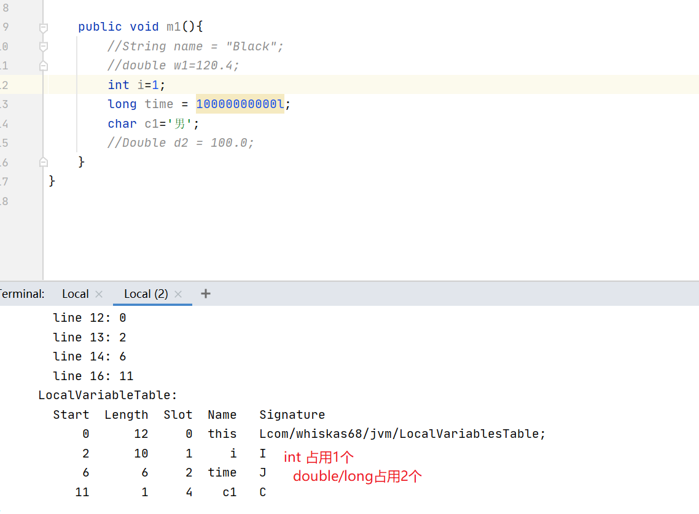
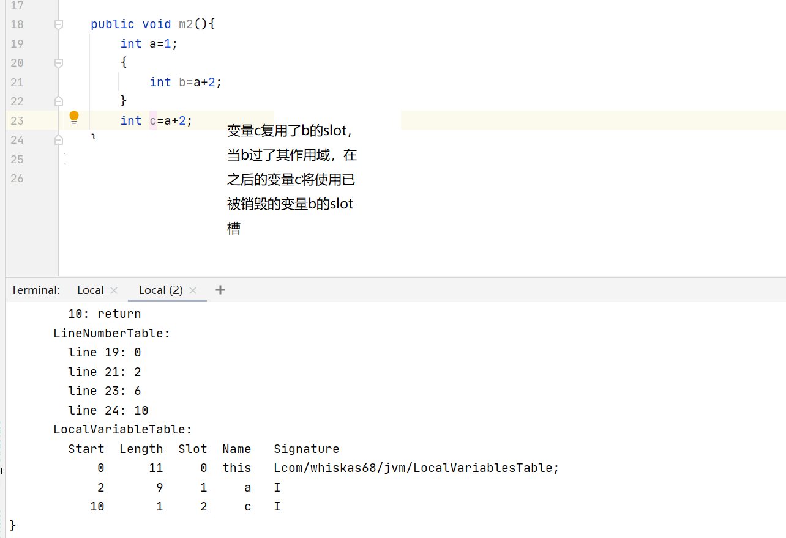
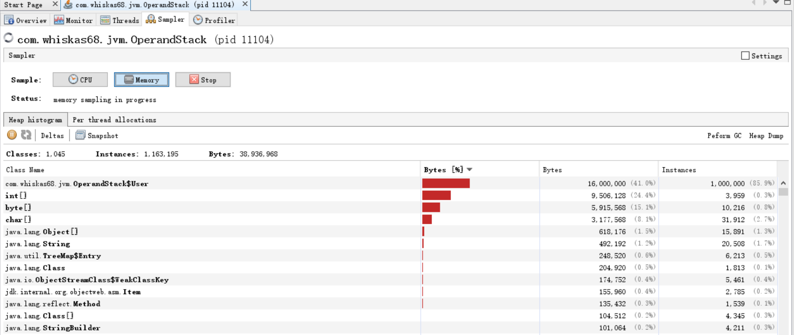
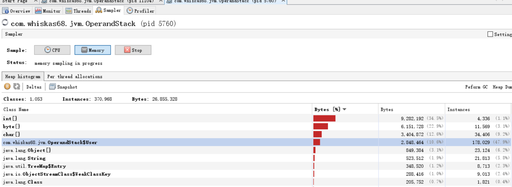

# 局部变量表 — 虚拟机栈

概念：

* 通过数字数组实现，存储方法参数和定义在方法体内的局部变量（包括基本数据类型，对象引用和returnAddress类型）
* 为线程私有，不存在线程安全问题
* 局部变量表的容量在编译期就确定下来。
* 栈的大小决定了方法嵌套的调用次数
* 局部变量表中的变量只在当前方法调用中有效，在方法执行的过程中，通过使用局部变量表来实现参数值到参数变量列表的传递过程，并随着栈帧的销毁而销毁。


代码示例：

```java
public class LocalVariablesTable {

    public static void main(String[] args) {
        LocalVariablesTable table = new LocalVariablesTable();
        int a = 1;
    }
}
```






## slot变量槽

### slot定义

* 局部变量表的基本单位 -- slot
* 存放各种基本数据类型，引用类型（reference），returnAddress类型的变量
* 32位以内的类型占用一个slot（包括returnAddress类型），64位的类型（long/double）占用2个slot

boolean=1个比特

byte=1个字节

int=4个字节

char=2个字节

short=2个字节

float=4个字节

double=8个字节

long=8个字节




### slot工作方法

* 给每个slot分配一个访问索引，通过索引来访问到局部变量表中指定的变量值
* 当调用方法的时候，方法参数和方法体内的局部变量会按照声明顺序被复制到局部变量表中的每个slot上
* 如果访问2个slot的变量值时，只需要使用前一个slot的索引即可
* 如果当前方法为实例方法或构造方法，则该对象引用this将会存放在index为0的slot，其他参数按照参数列表顺序排列
* 静态方法无法调用this，是由于该方法的局部变量表是不存在this的声明


### slot其他特性--重复利用

当一个局部变量越过了其作用域，那么之后声明的变量将复用之前变量的槽位，最终到达节省资源的目的。




### 补充说明

* 虚拟机通过局部变量表来完成方法中参数的传递。在栈帧中，与性能调优关系最为密切的部分正是局部变量表。
* 局部变量表中的变量也是重要的垃圾回收根节点，只要被局部变量表中直接或间接引用的对象都不会被回收


关于逃逸分析中，对象分配的问题（堆/栈）

```java
    /**
     * -Xmx256m -Xms256m -XX:-DoEscapeAnalysis -XX:+PrintGCDetails
     * 设置堆内存为256MB，关闭逃逸分析，并打印GC信息
     * 
     * */
class User{}

    public static void main(String[] args) {
        OperandStack ostack = new OperandStack();
        Long start = System.currentTimeMillis();
        for(int i=0;i<1000000;i++){
            ostack.alloc();
        }
        Long end = System.currentTimeMillis();
        Long cost = end-start;
        System.out.println("cost:"+cost);
        try {
            Thread.sleep(100000);
        } catch (InterruptedException e) {
            e.printStackTrace();
        }
    }
日志输出：
cost:26
Heap
 PSYoungGen      total 76288K, used 49821K [0x00000000fab00000, 0x0000000100000000, 0x0000000100000000)
  eden space 65536K, 76% used [0x00000000fab00000,0x00000000fdba7640,0x00000000feb00000)
  from space 10752K, 0% used [0x00000000ff580000,0x00000000ff580000,0x0000000100000000)
  to   space 10752K, 0% used [0x00000000feb00000,0x00000000feb00000,0x00000000ff580000)
 ParOldGen       total 175104K, used 0K [0x00000000f0000000, 0x00000000fab00000, 0x00000000fab00000)
  object space 175104K, 0% used [0x00000000f0000000,0x00000000f0000000,0x00000000fab00000)
 Metaspace       used 9297K, capacity 9608K, committed 9984K, reserved 1058816K
  class space    used 1071K, capacity 1163K, committed 1280K, reserved 1048576K
```



分析：从结果上看，新生代占用了49821KB的空间，其中eden区占了76%。堆空间（新生代+老年代+元空间+class空间）为255.62，约等于256M。截图显示，我们创建了100W个实例，耗时26毫秒


开启逃逸分析：-XX:+DoEscapeAnalysis

```java
日志输出：
cost:16
Heap
 PSYoungGen      total 76288K, used 36713K [0x00000000fab00000, 0x0000000100000000, 0x0000000100000000)
  eden space 65536K, 56% used [0x00000000fab00000,0x00000000fceda600,0x00000000feb00000)
  from space 10752K, 0% used [0x00000000ff580000,0x00000000ff580000,0x0000000100000000)
  to   space 10752K, 0% used [0x00000000feb00000,0x00000000feb00000,0x00000000ff580000)
 ParOldGen       total 175104K, used 0K [0x00000000f0000000, 0x00000000fab00000, 0x00000000fab00000)
  object space 175104K, 0% used [0x00000000f0000000,0x00000000f0000000,0x00000000fab00000)
 Metaspace       used 9287K, capacity 9608K, committed 9984K, reserved 1058816K
  class space    used 1071K, capacity 1163K, committed 1280K, reserved 1048576K
```




从结果上看，很明显堆上创建的对象少了许多，不到18万，并且从gc日志可以知道，堆空间的使用情况新生代使用了36713KB，从堆空间的使用上，有明显的减少。