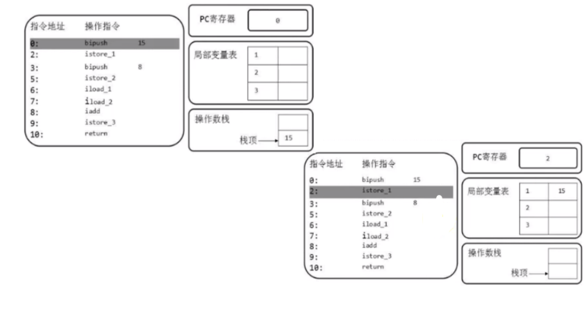
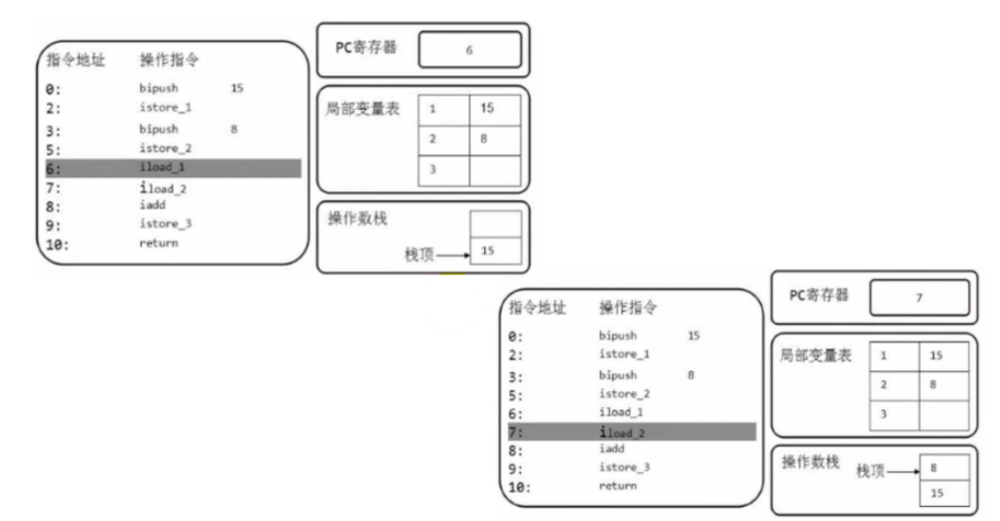
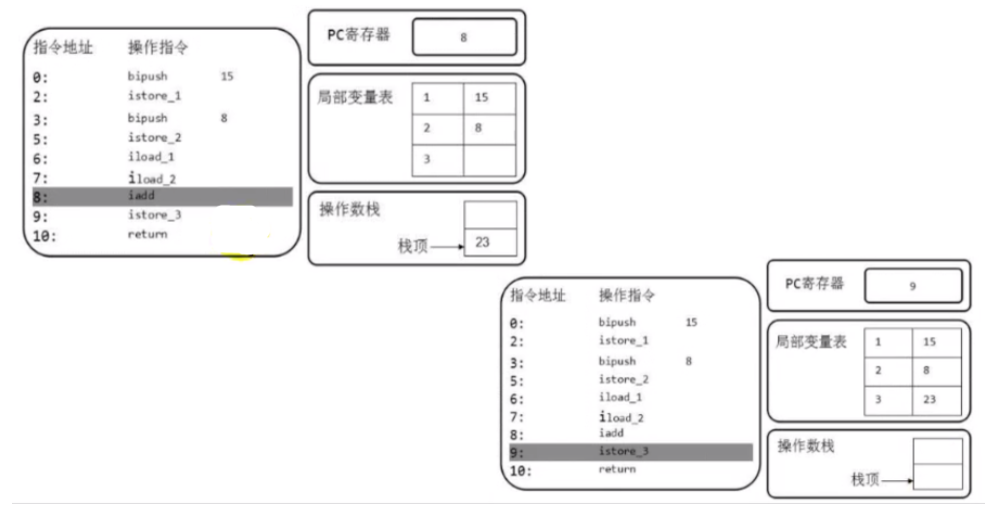

# 操作数栈 -- 虚拟机栈

概念：

* 使用数组或链表来实现，也被称为表示式栈
* 根据字节码，往栈中写入数据或提取数据，对应着入栈和出栈的过程。比如执行复制、交换、求和操作

特点：

* 保存计算过程的中间结果，同时作为计算过程中临时变量的存储空间
* 相当于jvm执行引擎的工作区
* 每个操作数都预先定义好栈深度的存储数值，在编译期就定义好，即为方法code属性中，max_stack的值
* 栈的元素可以为任意的数据类型(32bit=1个栈单位；64bit=2个)
* 采用入栈push、出栈pop来完成数据访问
* 如果调用的方法带有返回值，其返回值将被压入当前栈帧的操作数栈中，并更新pc寄存器中下一条字节码指令
* java虚拟机的解释引擎是基于栈的执行引擎，这其中的栈指的是操作数栈

1. 0：bipush 15 # 将15入栈到操作数栈顶
2. 2：istore_1 # 弹出操作数栈顶的元素15，保持到局部变量表索引为1的位置(0的位置为this)
3. 变量8，依次类推
4. 6：iload_1 # 将第一个变量15压入到操作数栈中
5. 7：同上
6. 8: iadd # 执行相加操作
7. 9: istore_3 # 结果23出栈，并保持到索引3的位置

### 栈顶缓存技术

JVM由于使用的栈式架构，使得每一次操作都需要更多的操作指令，更多的指令分派次数和内存读写次数，也带来一定的性能开销

基于上述的问题，即操作数存储在内存中，频繁的读写势必影响执行速度，因此将栈顶元素全部缓存在物理CPU的寄存器中，从而减少对内存的读写次数，提升执行引擎的执行效率