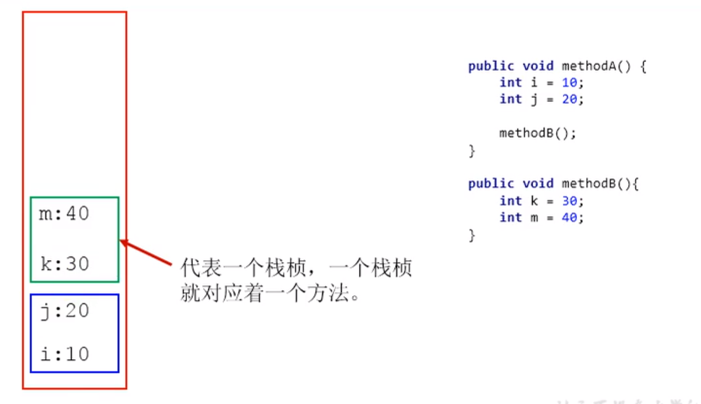

# Java虚拟机栈

概念：每个线程在创建时会创建一个虚拟机栈，其内部保持一个个栈帧（基本单位），对应着一次次的方法调用（不包括本地方法），生命周期和线程一致，负责解决运算逻辑的问题。




作用：保存方法的局部变量（8种基本数据类型和对象引用地址）、部分结果，并参与方法的调用和返回。

* 局部变量 vs 成员变量（属性）
* 基本数据类型 vs 引用数据类型（类、数组、接口）

特点：

* 是一种快速有效的分配存储方式，访问速度仅次于程序计数器

* 操作简单，JVM直接对Java栈的操作只有两个：

  1. 每个方法执行，伴随着进栈（入栈、压栈）
  2. 执行结束后的出栈工作

* 对于栈来说不存在垃圾回收问题，但存在OOM或栈溢出问题

  


常用问题：

```java
public class StackOverFlowError {
    /**
     * 递归问题导致栈溢出问题
     * 默认情况，count=11407
     * 设置-Xss=256k，count=2457
     * */
    public static int count =0;

    public static void main(String[] args) {

        count+=1;
        System.out.println(count);
        main(args);
    }
}
    
```


## 栈的存储结构

概念：每个线程都有自己私有的栈，栈中的数据都是以栈帧的结构存在。每个线程在执行的方法，都对应着一个栈帧，因此调用的方法和栈帧是一一对应的关系。栈帧是一个内存块，是一个数据集，负责维护方法执行过程中的各种数据信息。

工作原理：

1. Java虚拟机栈的操作只有两个 -- 对栈帧的压栈和出栈。在同个线程中的同一个时刻，只有一个栈帧被执行，因此也被称为当前栈帧，执行引擎运行的所有字节码指令只针对当前栈帧进行操作。

2. 如果当前方法（当前栈帧）调用了其他方法，则对应新的栈帧会被创建出来，并放在栈顶，成为当前栈帧
3. 如果当前方法在调用其他方法的时候，该方法在完成操作并返回数据的时候，当前栈帧会把该方法的执行结果返回给下一个待执行的栈帧，接着JVM就丢弃当前栈帧，使得下一个待执行的栈帧成为当前栈帧
4. Java有两个返回方式，一种是return指令，另一种是抛出异常（未被处理的线程）。这两种都会导致栈帧被弹出。


代码实例：

```java
public class OperandStack {
    public static void main(String[] args) {
        OperandStack ostack = new OperandStack();
        ostack.m1();
    }
    public void m1(){
        System.out.println("m1开始执行");
        m2();
        System.out.println("m1执行结束");
    }
    public void m2(){
        System.out.println("m2开始执行");
        m3();
        System.out.println("m2执行结束");
    }
    public void m3(){
        System.out.println("m3开始执行");
        System.out.println("m3执行结束");
    }
}
输出：
m1开始执行
m2开始执行
m3开始执行
m3执行结束
m2执行结束
m1执行结束
```


栈帧的内部结构

* 局部变量表

  存放编译期可知的8种基本数据类型(int,double,float,long,short,byte,char,boolean)。

* 操作数栈

* 动态链接

* 方法返回地址

* 附加信息


【引用】: p44 - p48          

