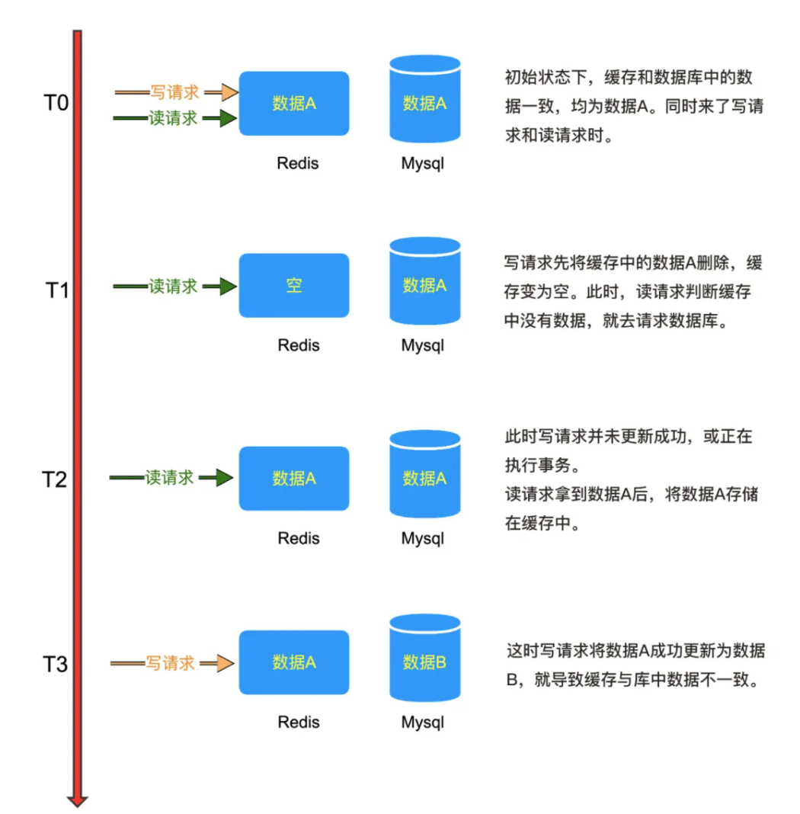
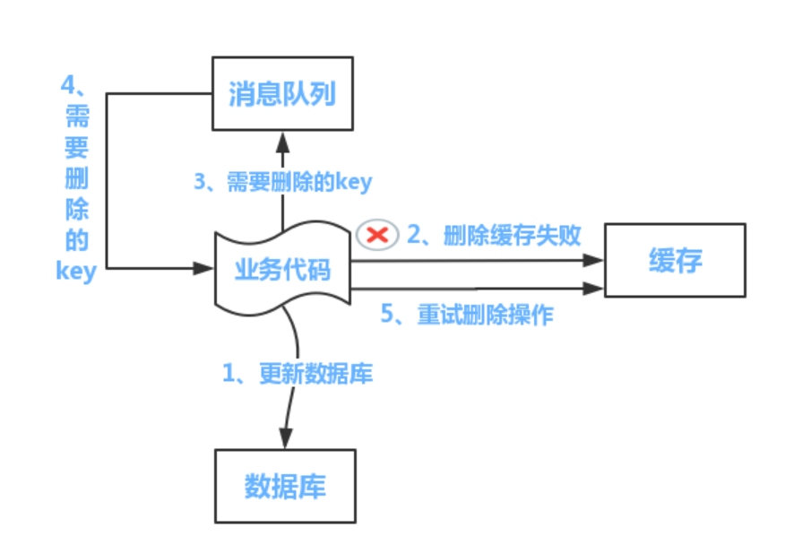
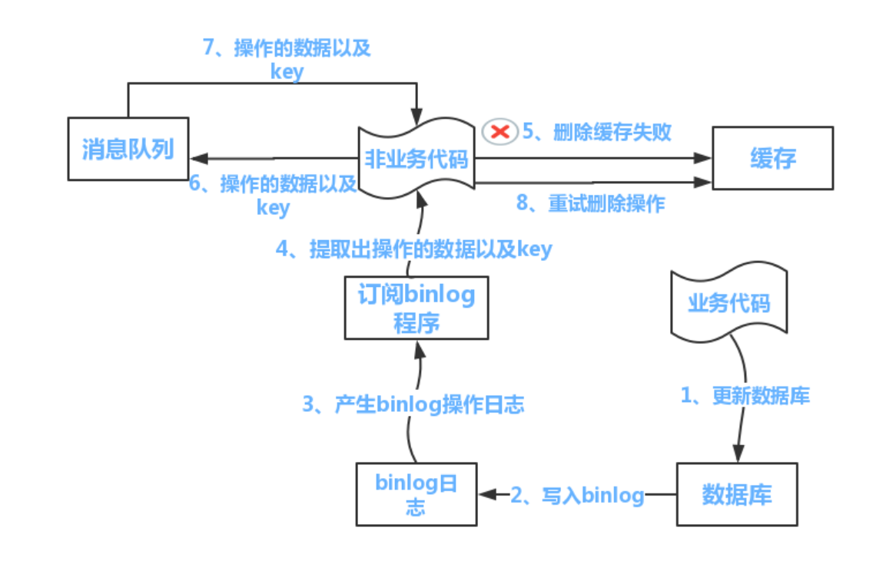

# 缓存

## Redis缓存

1. 缓存策略-旁路策略

   适用于读多写少的场景。该策略的实现逻辑如下：

   **写模式**

   * 更新DB
   * 删除缓存

   **读模式**

   * 从缓存中读取数据
   * 缓存不存在，则从DB读取数据
   * 最后将DB的数据加载回缓存中

   > 假设1：先删除缓存，在更新DB，会有什么问题？
   >
   > 线程A先删除缓存1，此时线程B找不到缓存1，就去DB读数据2，接着线程A，更新数据2，最后线程B就无法读取到事务A更新的数据2，而出现数据不一致
   >
   > 假设2：写模式一定没有问题吗?
   >
   > 1. 事务A从DB读数据1（缓存不存在）-> 2. 事务B写更新数据1到DB并删除缓存中数据1->3. 事务A将数据1写入缓存，导致数据不一致
   >
   > 步骤2要达到条件的前提是，写的速度要比读的速度快（实际发生情况几率比较小，除非出现从库访问异常）。



> 假设3：缓存删除失败
>
> 提供重试机制，对应有两套方案

方案一：



缺点是，对业务代码的侵入性较强

方案二：



另外启动一个订阅程序，去订阅binlog，获得需要操作的数据，来执行删除缓存的操作。

其中，订阅binlog程序的中间件有canal来实现。

缺点1：首次请求数据不存在问题

解决1：提前将热点数据load到缓存中

缺点2：写操作频繁而导致数据频繁被删除，而影响缓存命中率

解决2：添加分布式锁，保证更新缓存是线程安全；或者添加过期时间，来减少影响


## 本地缓存

### 理解Java 中强引用、软引用、弱引用和虚引用

**强引用**， 使用中最普遍的引用，如果一个对象具有强引用，则垃圾回收器绝不会回收它，只会报OutOfMemoryError错误。

```Java
Object strongReference = new Object();
```

如果强引用对象不使用时，需要弱化从而使GC能够进行回收。显式设置strongReference为null

```
strongReference = null;
```


或让其超出对象的生命周期范围外（因为引用存在栈中，当方法被完成调用，就会退出方法栈，对象则立即被gc回收），则gc认为该对象不存在引用，即可回收对象。

```
public void garbageCollection(){
  Object strongReference = new Object();

}
```

如果这个strongReference是全局变量时，就需要在不用这个对象时设置为null。比如ArrayList的底层设计中，就明确了对数组中元素的引用弱化，为了对全局变量elementData[i]的弱化。（elementData=null，无法对数组中的元素进行弱化）

```java
transient Object[] elementData; // 全局变量

public void clear() {
        modCount++;

        // clear to let GC do its work
        for (int i = 0; i < size; i++)
            elementData[i] = null;

        size = 0;
    }
```

使用clear()方法可以对数组中元素的引用进行内存释放。

总结：强引用，即使JVM发生内存溢出，也不会对强引用对象进行回收。


**软引用**

内存空间不足时，垃圾回收器才会回收它。可以对热点数据实现高速缓存。

软引用和引用队列配合使用（当JVM发生内存溢出时，会优先回收长时间闲置不用的软引用对象，而刚创建或较新的软引用对象则会被保留，这就是引用队列的作用）

```java
String str = new String("hot data");
ReferenceQueue<String> referenceQueue = new ReferenceQueue<>();
SoftRefernce<String> softReference = new SoftReference<>(str, referenceQueue);
```

业务场景：

客户端在刷新页面，重新发送请求时，后端是重新从数据库返回数据，还是从缓存中取出？

1. 如果客户端在浏览结束时就进行内容的回收，则刷新页面，则重新构建
2. 如果将浏览过的网页存储到内存中，则会造成内存的浪费，并导致内存溢出的风险

软引用可以很好的解决上述场景：

```java
// 伪代码
    // 获取浏览器对象进行浏览
    Browser browser = new Browser();
    // 从后台程序加载浏览页面
    BrowserPage page = browser.getPage();
    // 将浏览完毕的页面置为软引用
    SoftReference softReference = new SoftReference(page);

    // 回退或者再次浏览此页面时
    if(softReference.get() != null) {
        // 内存充足，还没有被回收器回收，直接获取缓存
        page = softReference.get();
    } else {
        // 内存不足，软引用的对象已经回收
        page = browser.getPage();
        // 重新构建软引用
        softReference = new SoftReference(page);
    }

```


**弱引用**

相比与软引用，拥有更短暂的生命周期，JVM一旦发现弱引用的对象，不管内存是否足够，都会进行内存回收，但不会立即回收

```java
String str = new String("weak Reference");
WeakReference<String> weakReference = new WeakReference<>(str);
// 弱引用转换为强引用
String strongReference = weakReference.get();
```

弱引用也支持一个引用队列。


**虚引用**，在任何时候都可能被垃圾回收。主要被用来跟踪对象被垃圾回收器的活动。必须和引用队列配合使用。

```java
    String str = new String("Phantom Reference");
    ReferenceQueue queue = new ReferenceQueue();
    // 创建虚引用，要求必须与一个引用队列关联
    PhantomReference pr = new PhantomReference(str, queue);

```


| 引用类型 | 被垃圾回收时间 | 用途               | 生存时间          |
| -------- | -------------- | ------------------ | ----------------- |
| 强引用   | 从来不会       | 对象的一般状态     | JVM停止运行时终止 |
| 软引用   | 当内存不足时   | 对象缓存           | 内存不足时终止    |
| 弱引用   | 正常垃圾回收时 | 对象缓存           | 垃圾回收后终止    |
| 虚引用   | 正常垃圾回收时 | 跟踪对象的垃圾回收 | 垃圾回收后终止    |


[本地缓存设计](<[理解Java的强引用、软引用、弱引用和虚引用 (juejin.cn)](https://juejin.cn/post/6844903665241686029)>)


