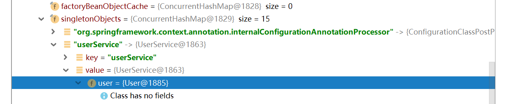
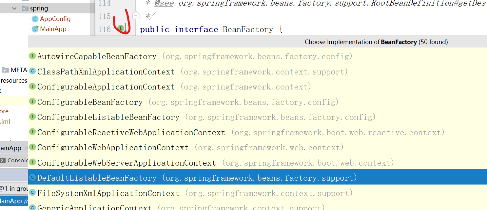
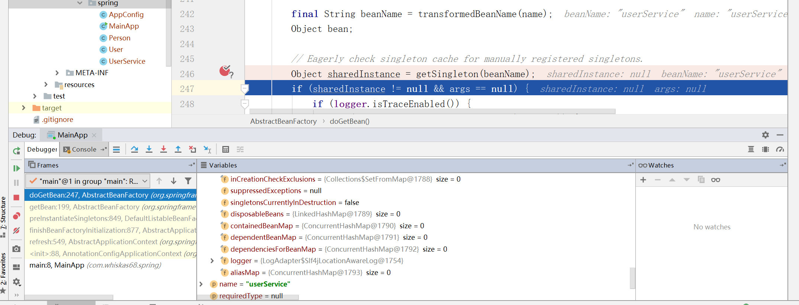
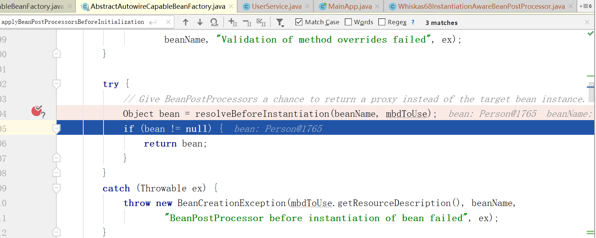
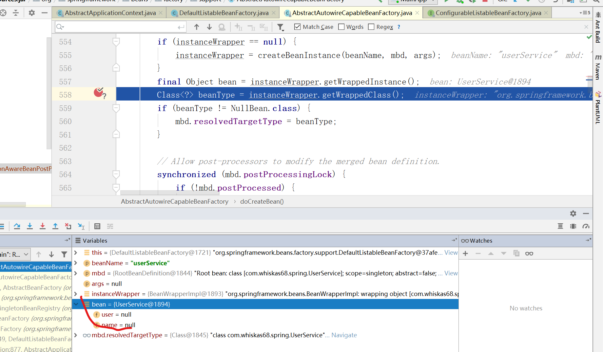
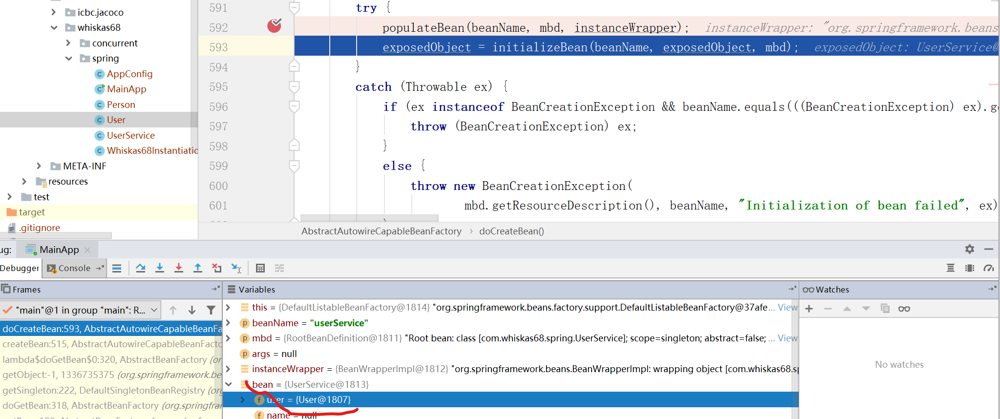
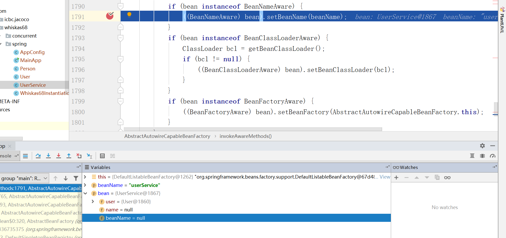
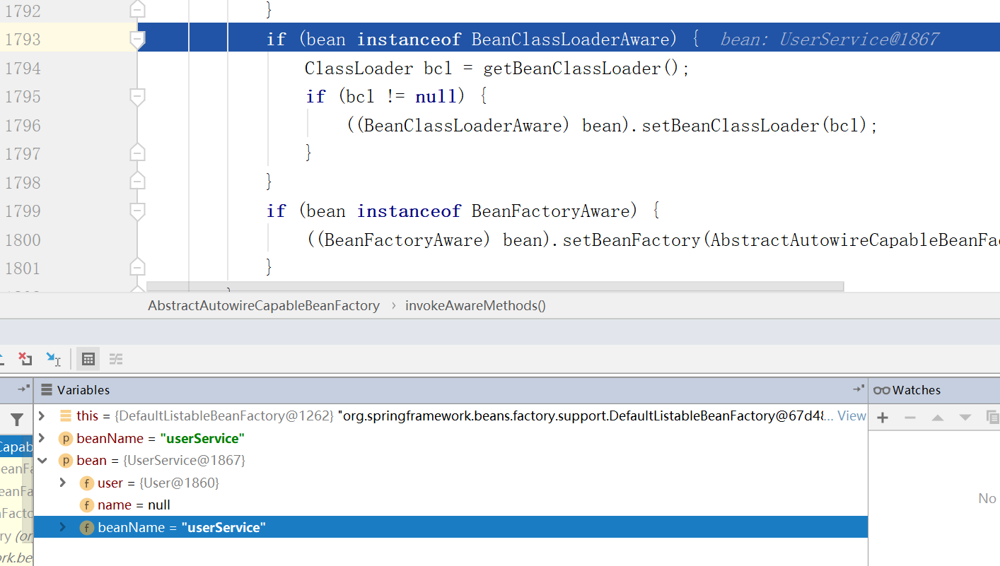

# spring 生命周期

狭义的生命周期：

class --> new 对象 --> 填充属性 --> 初始化 --> 放到单例池singletonObject（concurrentHashMap） --> 生成单例


实例化：

  实例化前  --对象 -- 调用InstantiationAwareBeanPostProcessor().postProcessBeforeInstantiation()

  实例化  -- 推断构造方法，new 对象(通过构造方法调用反射生成) doCreateBean().createBeanInstance()  -- 推断构造方法，原始对象，没有赋值


  实例化后 -- 属性赋值  -- InstantiationAwareBeanPostProcessor.postProcessAfterInstantiation()

AutowiredAnnotationBeanPostProcessor是实现类，完成对@AutoWired注解的目标对象完成属性注入

​	

初始化：

执行Aware接口

  初始化前 -- InitializingBean，BeanPostProcessor , invokeAwareMethods使用回调方法

  初始化  -- InitializingBean， PostConstructor init-method (xml设置)

初始化后 -- initializeBean.wrappedBean BeanPostProcessor接口 InstantiationAwareBeanPostProcessor().postProcessAfterInstantiation()最后放入单例池的实例

 aop -- proxyFactory代理对象

放入单例池

```java
/**
 * 初始化前进行属性赋值
 * */
@Component
public class UserService implements InitializingBean {

    @Autowired
    private User user;
    
    private String name;

    @Override
    public void afterPropertiesSet() throws Exception {
        this.name = "123";
    }
}
```

在AnnotationConfigApplicationContext context = new AnnotationConfigApplicationContext(AppConfig.class);的时候就完成bean的创建(beanFactory接口)




其中DefaultListableBeanFactory为beanFactory的实现类




## 实例化前调用方法 -- InstantationAwareBeanPostProcessor

代码调试：getBean() -> AnnotationConfigApplicationContext.refresh() -> AbstractApplicationContext.refresh().finishBeanFactoryInitialization(beanFactory) -> DefaultListableBeanFactory.beanFactory.preInstantiateSingletons() ->AbstractBeanFactory.getBean() -> AbstractBeanFactory.doGetBean() -> AbstractBeanFactory.doGetBean().getSingleton()为空。

结论：单例池中不存在“userService”的实例

代码调试：AbstractBeanFactory.doGetBean().createBean()





代码调试：AbstractBeanFactory.doGetBean().createBean().resolveBeforeInstantiation()



结论：在实例化前返回其他对象


## 实例化后未被属性注入

代码调试：AnnotationConfigApplicationContext.refresh() -> AbstractApplicationContext.refresh().finishBeanFactoryInitialization() -> DefaultListableBeanFactory.beanFactory.preInstantiateSingletons() ->AbstractBeanFactory.getBean().doGetBean() -> AbstractBeanFactory.doGetBean().createBean().doCreateBean().getWrappedClass()



结论：在instanceWrapper.createBeanInstance().instantiateBean()->

SimpleInstantiationStratery.getInstantiationStrategy().instantiate()->

BeanUtils.instantiateClass().ctor.newInstance()方法中，使用构造方法调用反射方法来创建实例。

​	

## 属性注入

在执行populateBean方法后完成user的属性注入，此时user属性就有值了




## 初始化前调用invokeAwareMethods方法

```java
@Component
public class UserService implements InitializingBean, BeanNameAware {

    @Autowired
    private User user;

    private String name;

    private String beanName;

    @Override
    public void afterPropertiesSet() throws Exception {
        this.name = "123";
    }

    @Override
    public void setBeanName(String name) {
        this.beanName = name;
    }
}
```

​	

在执行invokeAwareMethods方法前beanName属性值-no


执行后，beanName属性有值

