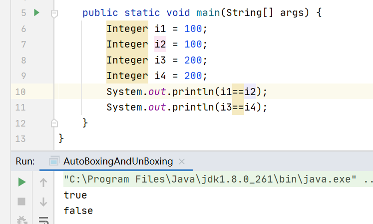

# Java基础 -- 面试

* 语法基础
* 面向对象
* 设计模式


## 装箱与拆箱

装箱，将基础数据类型转换为包装器类型，通过调用包装器的valueOf()方法实现

拆箱，自动将包装器类型转换为基础数据类型，通过调用包装器的xxValue方法实现

代码：

```java
Integer i = new Integer(5);
Integer i = 5; // 自动装箱

int n = i; // 拆箱
```

```java
public class AutoBoxingAndUnBoxing {

    public static void main(String[] args) {
        Integer i1 = 100;
        Integer i2 = 100;
        Integer i3 = 200;
        Integer i4 = 200;
        System.out.println(i1==i2);
        System.out.println(i3==i4);
    }
}
```




分析：

从结果可知，i1和i2指向的是同一个对象，而i3和i4则不是。通过Integer源码可知，Integer.valueOf方法的具体实现:

```java
    public static Integer valueOf(int i) {
        if (i >= IntegerCache.low && i <= IntegerCache.high)
            return IntegerCache.cache[i + (-IntegerCache.low)];
        return new Integer(i);
    }
...
    private static class IntegerCache {
        static final int low = -128;
        static final int high;
        static final Integer cache[];

        static {
            // high value may be configured by property
            int h = 127;
            String integerCacheHighPropValue =
                sun.misc.VM.getSavedProperty("java.lang.Integer.IntegerCache.high");
            if (integerCacheHighPropValue != null) {
                try {
                    int i = parseInt(integerCacheHighPropValue);
                    i = Math.max(i, 127);
                    // Maximum array size is Integer.MAX_VALUE
                    h = Math.min(i, Integer.MAX_VALUE - (-low) -1);
                } catch( NumberFormatException nfe) {
                    // If the property cannot be parsed into an int, ignore it.
                }
            }
            high = h;

            cache = new Integer[(high - low) + 1];
            int j = low;
            for(int k = 0; k < cache.length; k++)
                cache[k] = new Integer(j++);

            // range [-128, 127] must be interned (JLS7 5.1.7)
            assert IntegerCache.high >= 127;
        }

        private IntegerCache() {}
    }
```

可知通过valueOf方法在创建对象的时候，如果数值在[-128,127]之间，则返回指向IntegerCache.cache中已存在的对象引用，否则创建一个新的对象。

而其他类型的包装类则直接返回新的对象


## “==“和equals方法的区别